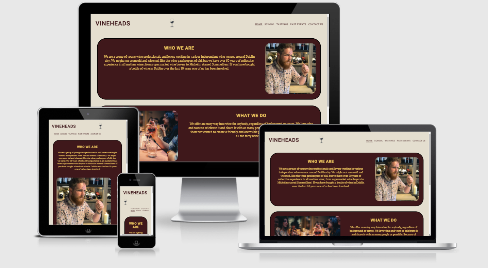
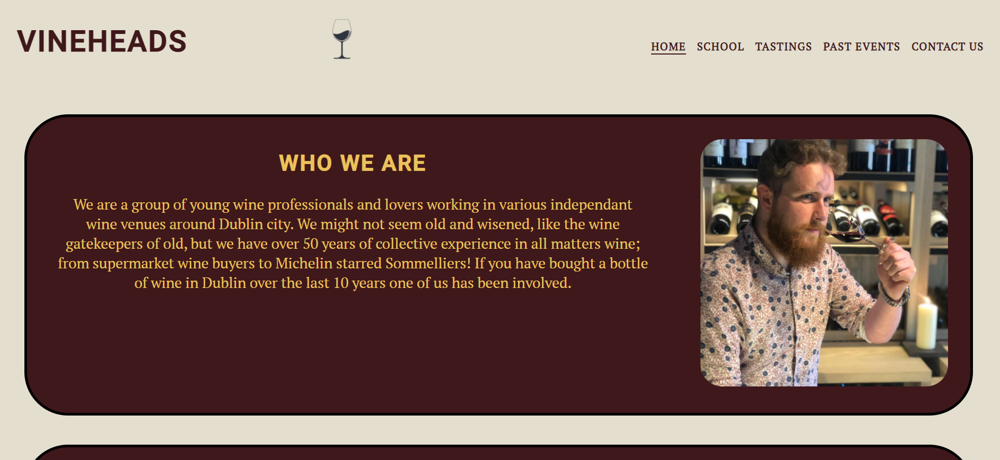
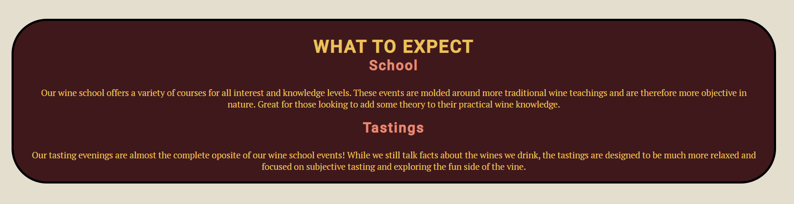
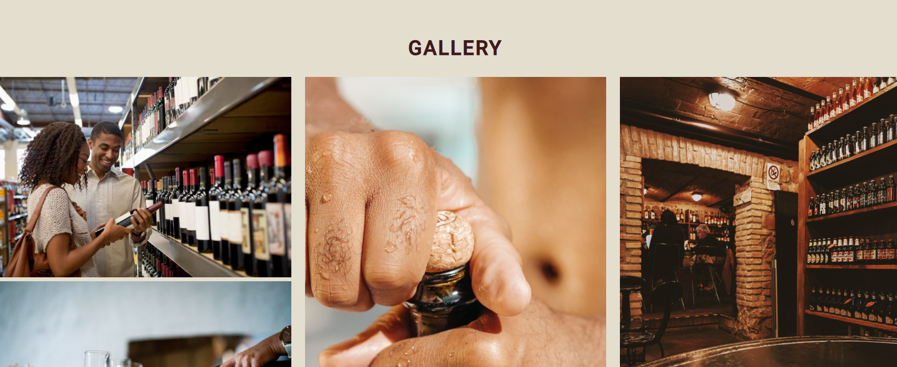
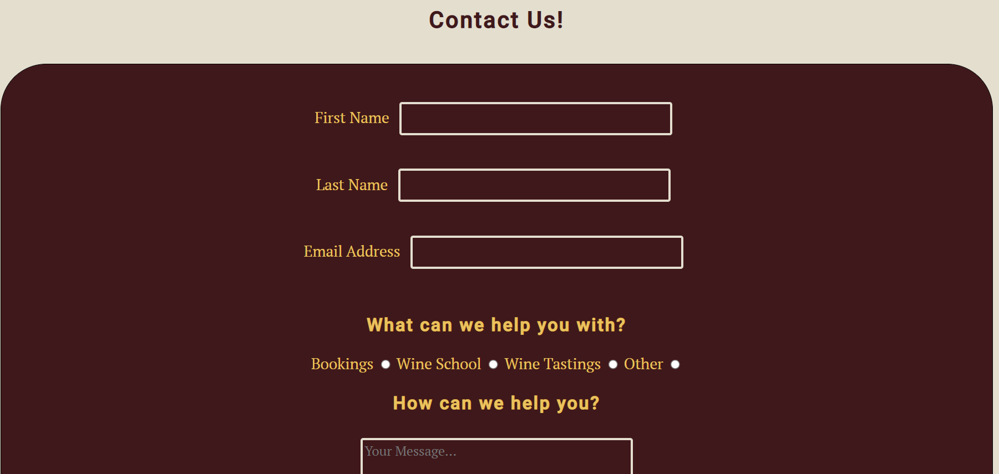

# Vineheads

Vineheads is a website that aims to make attending wine events as easy and approachable as possible. The site is targeted towards anyone with an interest in learning about and tasting wine. The site will outline who will run the events, how they will run and when they will run.

Users will be able to browse events, view past events and contact the business through the site.

## Features

### Existing Features

- __Navigation Bar__

  - Prominant feature on all pages. Responsive design includes navigation links to all 5 pages on the website with the name and logo elements also acting as nav elements for landing page on all pages.
  - This allows easy navigation of the website across all devices without forcing the user to use the browser navigation buttons.
  - Interactive elements ensure users know that the items are clickable.
  
  

- __Home Page__

    - Main landing page for the website.
    - Gives users basic information as to what the site is and what to expect from the business
    - Contains images to reinfoce the wine tasting branding.

- __Text Links__
    - Adds convenient, responsive and interactive navigation points for the tasting and school pages.

- __Footer__ 

  - The Footer contains links to the businesses social media channels. Styled to clearly show which particular website will be accessed by clicking the link.
  - The Footer also contains copyright information which is useful to protect business assets.

- __Gallery__
    - The responsive gallery section allows users to view past events and tastings the business has ran in the past.
    - The images will help users gain information on what to expect at the wine events.
    - The images can also be used to advetise and get users excited about the events.

- __Contact Page__
    - The contact page allows users to quickly send an inquiry to the business.
    - The selector buttons allow the user to chose what the query is relating to for more appropriate responses.
    - The message box allows the user to send a custom message to the business allowing them to inquire about specific items.

### Features left to Implement

    - A system for odering event tickets.
    - Embedded video for sample tastings.

### Technology Used 

    - Github
    - Gitpod
    - HTML 5
    - CSS 3

<em>you can also see images of my handwritten design notes in the assets section with the file names "vineheads-planning-*.jpg"</em>

## Testing

Manual testing was done through devices I own and included my laptop, phone and tablet. I also tested the website on popular web browsers on my windows laptop. These included Chrome, Firefox, Edge, Opera and Safari.

### Validator Testing

- HTML
  - No errors were returned when passing through the official [W3C validator](https://validator.w3.org/nu/?doc=https%3A%2F%2Fharryodubhghaill.github.io%2Fhtml-and-css-essentials-project%2Findex.html)
- CSS
  - No errors were found when passing through the official [Jigsaw validator](https://jigsaw.w3.org/css-validator/validator?uri=https%3A%2F%2Fharryodubhghaill.github.io%2Fhtml-and-css-essentials-project%2Findex.html&profile=css3svg&usermedium=all&warning=1&vextwarning=&lang=en)

## Deployment

- The site was deployed to GitHub pages. The steps to deploy are as follows: 
  - In the GitHub repository, navigate to the Settings tab 
  - From the source section drop-down menu, select the Main Branch
  - Once the Main Branch has been selected, the page will be automatically refreshed with a detailed ribbon display to indicate the successful deployment. 

The live link can be found here - https://harryodubhghaill.github.io/html-and-css-essentials-project/index.html

## Credits 

### Content 

- Nav element was inspited by code from CI "Love Running" project
- The icons in the footer were taken from [Font Awesome](https://fontawesome.com/)
- Info on flexbox was found at the following websites [Complete Guide to Flexbox](https://css-tricks.com/snippets/css/a-guide-to-flexbox/) and [Break to New Row with Flexbox](https://tobiasahlin.com/blog/flexbox-break-to-new-row/)

### Media

- Rights to man-smelling-wine.jpg are owned by me
- Stock style images were found in [this article](https://www.forbes.com/sites/marisadvari/2020/01/13/wine-tasting-101-how-to-taste-at-a-consumer-event/)
- Remaining images were sourced from [Pexels](https://www.pexels.com/)
- Fonts were sourced from [Google Fonts](https://fonts.google.com/)
- Colour scheme was generated by [Colormind](http://colormind.io/)